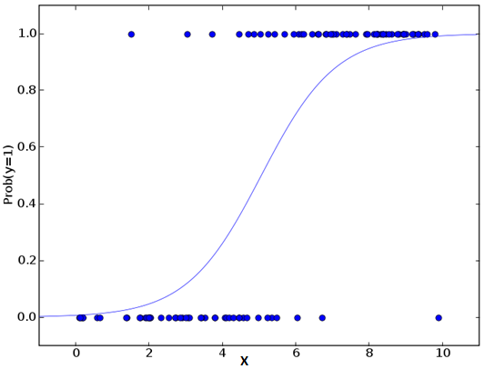

# Regression Algorithms

Regression analysis is a set of statistical processes for estimating the relationships between variables. It includes many techniques for modeling and analyzing several variables, when the focus is on the relationship between a dependent variable and one or more independent variables (or predictors). It's used for prediction and forecasting.

Regression algorithms are supervised.

The most popular are:

* Ordinary Least Squares Regression (OLSR)
* Linear Regression
* Logistic Regression
* Stepwise Regression
* Multivariate Adaptive Regression Splines (MARS)
* Locally Estimated Scatterplot Smoothing (LOESS)

**Linear Regression**

Used to estimate real values based on continuous variable(s). Here, we establish a relationship between independent and dependent variables by fitting the best line (function). This best fit line is known as a regression line and is represented by a linear equation: Y = a*X + b, with:
* Y: dependent variable
* a: slope
* X: independent variable
* b: intercept

These coefficients a and b are derived based on minimizing the sum of squared difference between data points and the regression line (Ordinary Least Squares).
Linear Regression is of mainly two types: *Simple Linear Regression* and *Multiple Linear Regression*. Simple Linear Regression is characterized by one independent variable. And, Multiple Linear Regression (as the name suggests) is characterized by multiple (more than 1) independent variables. While finding best fit line, you can fit a polynomial or curvilinear regression. And these are known as polynomial or curvilinear regression.

*Python Code:*
```python
from sklearn import linear_model
# load train and test datasets
# identify feature and response variable(s) and values must be numeric and numpy arrays
x_train = input_variables_values_training_dataset
y_train = target_variables_values_training_dataset
model = linear_model.LinearRegression()
# train the model using the training sets and check score
model.fit(x_train, y_train)
model.score(x_train, y_train)
# Equation coefficient and Intercept
print("Coefficient: \n", model.coef_)
print("Intercept: \n", model.intercept_)
# Predict Output
predicted = model.predict(x_test)
```

**Logistic Regression**

It’s a *classification algorithm*. It is used to estimate discrete values based on a given set of independent variable(s). It predicts the probability of occurrence of an event by fitting data to a logit function. Hence, it is also known as a logit function.

Coming to the math, the log odds of the outcome is modeled as a linear combination of the predictor variables:

```
odds= p/ (1-p) = probability of event occurrence / probability of not event occurrence
ln(odds) = ln(p/(1-p))
logit(p) = ln(p/(1-p)) = b0+b1X1+b2X2+b3X3....+bkXk
```

Above, p is the probability of presence of the characteristic of interest. It chooses parameters that maximize the likelihood of observing the sample values rather than that minimize the sum of squared errors (like in ordinary regression).

Using a log is one of the best mathematical ways to replicate a step function:



*Python Code:*
```python
from sklearn.linear_model import LogisticRegression
model = LogisticRegression()
# train the model using the training sets and check score
model.fit(X, y)
model.score(X, y)
# equation coefficient and Intercept
print('Coefficient: \n', model.coef_)
print('Intercept: \n', model.intercept_)
# predict output
predicted = model.predict(x_test)
```
