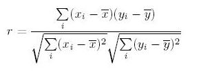

# Correlation Interview Questions

The most widely used correlation coefficient is the Pearson Coefficient:



**Explanation:** It's the ratio of covariance of two variables to a product (of the variables). It produces a value between +1 and -1. An extreme value on both sides means they are strongly correlated with each other. A value of zero indicates a NIL correlation but not a non-dependence.

**1. Does correlation and dependency mean the same thing? In simple words if two event have correlation of zero, does this convey they are not dependent and vice-versa?**

  A non-dependency between two variables means a zero correlation. However, the opposite is not true. A zero correlation can even have a perfect dependency. Here is an example:

  

  In this scenario, where the square of x is linearly dependent on y (the dependent variable), everything to the right of y axis is negative correlated and to the left is positively correlated. So what will be the Pearson Correlation coefficient? It will be 0 between these two variables. What does that mean? A pair of variables which are perfectly dependent on each other can have 0 correlation.

  *Important:* Correlation quantifies the linear dependence of two variables. It cannot capture non-linear relationship between two variables.

  (see [must read book in data analytics/data science](https://www.analyticsvidhya.com/blog/2015/06/infographic-read-books-analytics-data-science/))

**2. If two variables have a high correlation with a third variable, does this convey they will also be highly correlated? Is it even possible that A and B are positively correlated to another variable C? Is it possible that A and B are negatively correlated with each other?**

  Suppose that X, Y, and Z are random variables. X and Y are positively correlated and Y and Z are likewise positively correlated. Does it follow that X and Z must be positively correlated?

  As we shall see by example, the answer is (perhaps surprisingly) “No”. We may prove that if the correlation are sufficiently close to 1, then X and Z must be positively correlated.

  Let’s assume C(x,y) is the correlation coefficient between x and y. Likewise we have C(x,z) and C(y,z). Here is an equation which comes from solving correlation equation mathematically.

   ```
   C(x,y) = C(y,z) * C(z,x) - Square Root((1 - C(y,z)^2)* (1 - C(z,x)^2))
   ```

   Now if we want C(x,y) to be more than zero, we  basically want the RHS of the above equation to be positive. Hence, you need to solve for:

   ```
   C(y,z) * C(z,x) > Square Root ( (1 - C(y,z)^2 ) *  (1 - C(z,x)^2 ) )
   ```

   We can actually solve the above equation for both C(y,z) > 0 and C(y,z) < 0 together by squaring both sides. This will finally give the result as C(x,y) is a non zero number if following equation holds true:

   ```
   C(y,z) ^ 2 + C(z,x) ^ 2 > 1
   ```
   This is the equation of a circle:
   

   If the two known correlations are in the A zone, the third correlation will be positive. If they lie in the B zone, the third correlation will be negative. Inside the circle, we cannot say anything about the relationship. A very interesting insight here is that even if C(y,z) and C(z,x) are 0.5, C(x,y) can actually also be negative.

**3. Can a single outlier decrease or increase the correlation with a big magnitude? Is Pearson coefficient very sensitive to outliers?**

  The answer is Yes. Even a single outlier can change the direction of the coefficient. Here are a few examples, all of which have the same correlation coefficient of 0.81.

  

  Consider the last two graphs(X3Y3 and X4Y4). X3Y3 is clearly a case of perfect correlation where a single outlier brings down the coefficient significantly. The last graph is completely opposite, the correlation coefficient becomes a high positive number because of a single outlier. Conclusively, this turns out to be the biggest concern with correlation coefficient, it is highly influence by the others.

**4. Does causation imply correlation?**

  If you have read our above three answers, I am sure you will be able to answer this one. The answer is No, because causation can also lead to a non-linear relationship. Let's understand how!

  Below is the graph showing density of water from 0 to 12 degrees Celsius. We know that density is an effect of changing temperature. But density, can reach its maximum value at 4 degrees Celsius. Therefore, it will not be linearly correlated to the temperature.

  

**5. What’s the difference between correlation and simple linear regression?**

**6. How to choose between Pearson and Spearman correlation?**

**7. How would you explain the difference between correlation and covariance?**

  If you skipped the mathematical formula of correlation at the start of this article now is the time to check it out again.

  Correlation is simply the normalized covariance with the standard deviation of both the factors. This is done to ensure we get a number between +1 and -1. Covariance is very difficult to compare as it depends on the units of the two variable. It might come out to be the case that marks of student is more correlated to his toe nail in millimeters than it is to his attendance rate.

  This is just because of the difference in units of the second variable. Hence, we see a need to normalize this covariance with some spread to make sure we compare apples with apples. This normalized number is known as correlation.
