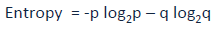
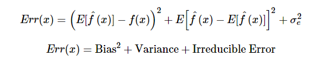

# Machine Learning Interview Questions

**1. You are given a training dataset with 1000 columns and 1 million rows. The dataset is based on a classification problem. Your manager has asked you to reduce the dimension of the data so that model computation time is reduced. Your machine has memory constraints. What do you do? (You are free to make practical assumptions)**

  *Answer:* Processing a high dimensional dataset on a limited memory machine is a strenuous task, your interviewer would be fully aware of that. Following are the methods you can use to tackle such a situation.
  * Since we have low RAM, we should close all other applications running on our machine, including the web browser, so that most of the memory can be put to use.
  * We can randomly sample the dataset. This means, we can create a smaller dataset, let’s say, having 1000 variables and 300,000 rows and do the computations.
  * To reduce dimensionality, we can separate the numerical and categorical variables and remove the correlated variables. For numerical variables, we’ll use correlation. For categorical variables, we’ll use chi-square test.
  * Also, we can use PCA and pick the components which can explain the maximum variance in the dataset
  * Using [online learning](https://www.analyticsvidhya.com/blog/2015/01/introduction-online-machine-learning-simplified-2/) algorithms like Vowpal Wabbit (available in Python) is a possible option.
  * Building a linear model using [Stochastic Gradient Descent](https://en.wikipedia.org/wiki/Stochastic_gradient_descent) is also helpful.
  * We can also apply our business understanding to estimate which predictors impact the response variable. But, this is an intuitive approach, failing to identify useful predictors might result in significant loss of information.

**2. Is rotation necessary in PCA? If yes, Why? What will happen if you don’t rotate the components?**

  *Answer:* Yes, rotation (orthogonal) is necessary because it maximizes the difference between variance captured by the component. This makes the components easier to interpret. Not to forget, that’s the motive of doing [PCA](https://www.analyticsvidhya.com/blog/2016/03/practical-guide-principal-component-analysis-python/), where we aim to select fewer components (than features) which can explain the maximum variance in the dataset. By performing rotation, the relative location of the components doesn’t change, it only changes the actual coordinates of the points. If we don’t rotate the components, the effect of PCA will diminish and we’ll have to select more components to explain variance in the dataset.

**3. You are given a dataset. The dataset is missing values spread along 1 standard deviation from the median. What percentage of data would remain unaffected? Why?**

  *Answer:* This question has enough hints for you to start thinking! Since the data is spread across the median, let’s assume it’s a normal distribution. We know, in a normal distribution, ~68% of the data lies in 1 standard deviation from the mean (or mode, median), which leaves ~32% of the data unaffected. Therefore, ~32% of the data would remain unaffected by missing values.

**4. You are given a dataset on cancer detection. You’ve built a classification model and achieved an accuracy of 96%. Why shouldn’t you be happy with your model performance? What can you do about it?**

  *Answer:* If you have worked on enough datasets, you should deduce that cancer detection results in imbalanced data. In an [imbalanced dataset](https://www.analyticsvidhya.com/blog/2016/03/practical-guide-deal-imbalanced-classification-problems/), accuracy should not be used as a measure of performance because 96% (as given) might only be predicting the majority class correctly, but our class of interest is minority class (4%) which is the people who actually got diagnosed with cancer. Hence, in order to evaluate model performance, we should use Sensitivity (True Positive Rate), Specificity (True Negative Rate), F measure to determine class wise performance of the classifier. If the minority class performance is found to be poor, we can undertake the following steps.
  1. We can use undersampling, oversampling or SMOTE to make the data balanced.
  2. We can alter the prediction threshold value by doing [probability calibration](https://www.analyticsvidhya.com/blog/2016/07/platt-scaling-isotonic-regression-minimize-logloss-error/) and finding an optimal threshold using AUC-ROC curve.
  3. We can assign weight to classes such that the minority classes get larger weight
  4. We can also use anomaly detection.

**5. Why is Naive Bayes so “naive”?**

  *Answer:* naive Bayes is so “naive” because it assumes that all of the features in a dataset are equally important and independent. As we know, these assumptions are rarely true in a real world scenario.

**6. Explain prior probability, likelihood and marginal likelihood in the context of naive Bayes algorithm?**

  *Answer:*
  * Prior probability is nothing but the proportion of dependent (binary) variables the dataset. It is the closest guess you can make about a class, without any further information. For example: In a dataset, the dependent variable is binary (1 or 0). The proportion of 1 (spam) is 70% and 0 (not spam) is 30%. Hence, we can estimate that there are 70% chances that any new email would be classified as spam.
  * Likelihood is the probability of classifying a given observation as 1 in presence of some other variable. For example: The probability that the word “FREE” is used in previous spam messages is likelihood.
  * Marginal likelihood is the probability that the word “FREE” is used in any message.

**7. You are working on a time series dataset. Your manager has asked you to build a high accuracy model. You start with the decision tree algorithm, since you know it works fairly well on all kinds of data. Later, you tried a time series regression model and got  higher accuracy than decision tree model. Can this happen? Why?**

  *Answer:* Time series data is known to possess linearity. On the other hand, a decision tree algorithm is known to work best to detect nonlinear interactions. The reason why the decision tree failed to provide robust predictions is because it couldn’t map linear relationship as good as a regression model did. Therefore, we learned that, a linear regression model can provide robust prediction given that the dataset satisfies its [linearity assumptions](https://www.analyticsvidhya.com/blog/2016/07/deeper-regression-analysis-assumptions-plots-solutions/).

**8. You are assigned a new project which involves helping a food delivery company save more money. The problem is, the company’s delivery team aren’t able to deliver the food on time. As a result, their customers are unhappy. And, to keep them happy, they end up delivering the food for free. Which machine learning algorithm can save them?**

  *Answer:* You might have started hopping through the list of ML algorithms in your mind. But wait! Such questions are asked to test your machine learning fundamentals!
  This is not a machine learning problem. This is a route optimization problem. A machine learning problem consist of three aspects:
  * there exists a pattern
  * you cannot solve it mathematically
  * you have data on it
  Always look for these three factors to decide if machine learning is a tool to solve a particular problem.

**9. You came to know that your model is suffering from low bias and high variance. Which algorithm should you use to tackle it? Why?**

  *Answer:* Low bias occurs when the model’s predicted values are near the actual values. In other words, the model becomes flexible enough to mimic the training data distribution. While it sound like great achievement, don’t forget, a flexible model has no generalization capabilities. It means that when this model is tested on unseen data, it gives disappointing results.

  In such situations, we can use bagging algorithms (like random forest) to tackle high variance problems. Bagging algorithms divide a dataset into subsets made with repeated randomized sampling. Then, these samples are used to generate a set of models using a single learning algorithm. Later, the model predictions are combined using voting (classification) or averaging (regression).

  Also to combat high variance, we can:
  1. Use regularization techniques, where higher model coefficients get penalized, hence lowering model complexity.
  2. Use top n features from variable importance chart. Maybe, with all the variable in the dataset, the algorithm is having difficulty finding the meaningful signal.

**10. You are given a dataset. The dataset contains many variables, some of which are highly correlated and you know about it. Your manager has asked you to run PCA. Would you remove correlated variables first? Why?**

  *Answer:* Chances are, you might be tempted to say No, but that would be incorrect. Discarding correlated variables have a substantial effect on PCA because, in presence of correlated variables, the variance explained by a particular component gets inflated.

  *Example:* You have 3 variables in a dataset, of which 2 are correlated. If you run PCA on this dataset, the first principal component would exhibit twice the variance than it would exhibit with uncorrelated variables. Also, adding correlated variables lets PCA put more importance on those variables, which is misleading.

**11. After spending several hours, you are anxious to build a high accuracy model. As a result, you build 5 GBM models, thinking a boosting algorithm would do the magic. Unfortunately, none of the models could perform better than the benchmark score. Finally, you decide to combine those models. Although, ensemble models are known to return high accuracy, this is not the case. What did you miss?**

  *Answer:* As we know, ensemble learners are based on the idea of combining weak learners to create strong learners. But these learners provide superior results when the combined models are uncorrelated. Since, we have used 5 GBM models and got no accuracy improvement, it suggests that the models are correlated. The problem with correlated models is, all the models provided the same information.

  *Example:* If model 1 has classified User1122 as 1, there are high chances model 2 and 3 would have done the same, even if its actual value is 0. Therefore, ensemble learners are built on the premise of combining weak uncorrelated models to obtain better predictions.

**12. How is kNN different from kmeans clustering?**

  *Answer:* Don’t get mislead by “k” in the names. You should know that the fundamental difference between both these algorithms is, kmeans is unsupervised in nature and kNN is supervised. kmeans is a clustering algorithm. kNN is a classification (or regression) algorithm. kmeans algorithm partitions a dataset into clusters such that a cluster formed is homogeneous and the points in each cluster are close to each other. The algorithm tries to maintain enough separability between these clusters. Due to unsupervised nature, the clusters have no labels. kNN algorithm tries to classify an unlabeled observation based on its k (can be any number) surrounding neighbors. It is also known as lazy learner because it involves minimal training of model. Hence, it doesn’t use training data to make generalization on unseen dataset.

**13. How are True Positive Rate and Recall related? Write the Equation.**

  *Answer:* True Positivie Rate = Recall = TP / (TP + FN) (see [evaluation metrics](https://www.analyticsvidhya.com/blog/2016/02/7-important-model-evaluation-error-metrics/))

**14. You have built a multiple regression model. Your model R² isn’t as good as you wanted. For improvement, you remove the intercept term, your model R² becomes 0.8 from 0.3. It it possible? How?**

  *Answer:* Yes it is possible. We need to understand the significance of intercept term in a regresion model. The intercept term shows model prediction without any independent variable i.e. mean prediction. The formula of R² = 1 – ∑(y – y')²/∑(y – ymean)² where y' is predicted value.

  When intercept term is present, R² value evaluates your model with respect to the mean model. In absence of intercept term (ymean), the model can make no such evaluation, with large denominator, ∑(y - y´)²/∑(y)² equation’s value becomes smaller than actual, resulting in higher R².

**15. After analyzing the model, your manager has informed that your regression model is suffering from multicollinearity. How would you check if he’s right? Without losing any information, can you still build a better model?**

  *Answer:* To check multicollinearity, we can create a correlation matrix to identify & remove variables having correlation above 75% (deciding a threshold is subjective). In addition, we can use calculate VIF (variance inflation factor) to check the presence of multicollinearity. VIF value <= 4 suggests no multicollinearity whereas a value of >= 10 implies serious multicollinearity. Also, we can use tolerance as an indicator of multicollinearity.

  But, removing correlated variables might lead to loss of information. In order to retain those variables, we can use penalized regression models like ridge or lasso regression. Also, we can add some random noise in correlated variable so that the variables become different from each other. But, adding noise might affect the prediction accuracy, hence this approach should be used carefully. (see [regression](https://www.analyticsvidhya.com/blog/2016/07/deeper-regression-analysis-assumptions-plots-solutions/))

**16. When is Ridge regression favorable over Lasso Regression?**

  *Answer:* You can quote ISLR’s authors Hastie, Tibshirani who asserted that, in presence of few variables with medium / large sized effect, use lasso regression. In presence, of many variables with small / medium sized effect use ridge regression.

  Conceptually, we can say, lasso regression (L1) does both variable selection and parameter shrinkage, whereas Ridge regression only does parameters shrinkage and end up including all the coefficients in the model. In presence of correlated variables, ridge regression might be the preferred choice. Also, ridge regression works best in situations where the least square estimates have higher variance. Therefore, it depends on our model objective. (see [ridge and lasso regression](https://www.analyticsvidhya.com/blog/2016/01/complete-tutorial-ridge-lasso-regression-python/))

**17. Rise in global average temperature led to decrease in number of pirates around the world. Does that mean that decrease in number of pirates caused the climate change?**

  *Answer:* After reading this question, you should have understood that this is a classic case of “causation and correlation”. No, we can’t conclude that decrease in number of pirates caused the climate change because there might be other factors (lurking or confounding variables) influencing this phenomenon.

  Therefore, there might be correlation between global average temperature and number of pirates, but based on this information we can’t say that pirates died because of rise in global average temperature. (see [causation and correlation](https://www.analyticsvidhya.com/blog/2015/06/establish-causality-events/))

**18. While working on a dataset, how do you select important variables? Explain your methods.**
  *Answer:* Following are the methods of variable selection you can use:
  1. Remove the correlated variables prior to selecting important variables
  2. Use linear regression and select variables based on p values
  3. Use Forward Selection, Backward Selection, Stepwise Selection
  4. Use Random Forest, XgBoost and plot variable importance chart
  5. Use Lasso Regression
  6. Measure information gain for the available set of features and select top n features accordingly

**19. What is the difference between covariance and correlation?**

  *Answer:* Correlation is the standardized form of covariance

  Covariances are difficult to compare. For example: if we calculate the covariances of salary ($) and age (years), we’ll get different covariances which can’t be compared because of having unequal scales. To combat such situation, we calculate correlation to get a value between -1 and 1, irrespective of their respective scale.

**20. Is it possible to capture correlation between continuous and categorical variables? If yes, how?**

  *Answer:* Yes, yes we can use ANCOVA (analysis of covariance) technique to capture association between continuous and categorical variables.

**21. Both being tree based algorithms, how is random forest different from Gradient boosting algorithm (GBM)?**

  *Answer:* The fundamental difference is, random forest uses bagging technique to make predictions. GBM uses boosting techniques to make predictions.

  In bagging technique, a dataset is divided into n samples using randomized sampling. Then, using a single learning algorithm a model is built on all samples. Later, the resultant predictions are combined using voting or averaging. Bagging is done in parallel. In boosting, after the first round of predictions, the algorithm weighs misclassified predictions higher, such that they can be corrected in the succeeding round. This sequential process of giving higher weights to misclassified predictions continue until a stopping criterion is reached.

  Random forest improves model accuracy by reducing variance (mainly). The trees grown are uncorrelated to maximize the decrease in variance. On the other hand, GBM improves accuracy by reducing both bias and variance in a model. (see [tree based modeling](https://www.analyticsvidhya.com/blog/2016/04/complete-tutorial-tree-based-modeling-scratch-in-python/))

**22. Running a binary classification tree algorithm is the easy part. Do you know how does a tree splitting takes place i.e. how does the tree decide which variable to split at the root node and succeeding nodes?**

  *Answer:* A classification tree make decisions based on Gini index and Node Entropy. In simple words, the tree algorithm finds the best possible feature which can divide the dataset into the purest possible children nodes.
  Gini index says that if we select two items from a population at random then they must be of same class and probability for this is 1 if the population is pure. We can calculate Gini as following:
  Calculate Gini for sub-nodes, using formula sum of square of probability for success and failure (p² + q²)
  Calculate Gini for split using weighted Gini score of each node of that split
  Entropy is the measure of impurity as given by (for binary class):
  

  Here p and q are probability of success and failure respectively in that node. Entropy is zero when a node is homogeneous. It is maximum when both classes are present in a node at 50% - 50%. Lower entropy is desirable.

**23. You’ve built a random forest model with 10,000 trees. You got delighted after getting training error as 0.00. But the validation error is 34.23. What is going on? Haven’t you trained your model perfectly?**

  *Answer:* The model has overfitted. Training error 0.00 means the classifier has minimized the training data patterns to an extent that they are not available in the unseen data. Hence, when this classifier was run on unseen sample, it couldn’t find those patterns and returned predictions with higher error. In random forest, it happens when we use larger number of trees than necessary. Hence, to avoid this situation, we should tune the number of trees using cross validation.

**24. You’ve got a dataset to work having p (no. of variable) > n (no. of observation). Why is OLS as bad option to work with? Which techniques would be best to use? Why?**

  *Answer:* In such high dimensional datasets, we can’t use classical regression techniques, since their assumptions tend to fail. When p > n, we can no longer calculate a unique least square coefficient estimate, the variances become infinite, so OLS cannot be used at all.

  To combat this situation, we can use penalized regression methods like lasso, LARS, ridge which can shrink the coefficients to reduce variance. Precisely, ridge regression works best in situations where the least square estimates have higher variance.

  Among other methods include subset regression, forward stepwise regression.

**25. What is convex hull? (Hint: Think SVM)**

  *Answer:* In case of linearly separable data, convex hull represents the outer boundaris of the two group of data points. Once convex hull is created, we get maximum margin hyperplane (MMH) as a perpendicular bisector between two convex hulls. MMH is the line which attempts to create greatest separation between two groups.

**26. We know that one hot encoding increases the dimensionality of a dataset. But label encoding doesn’t. How?**

  *Answer:* Don’t get baffled at this question. It’s a simple question asking the difference between the two.

  Using one hot encoding, the dimensionalty (a.k.a. features) in a data set get increased because it creates a new variable for each level present in categorical variables. For example: let’ssay we have a variable ‘color’. The variable has 3 levels namely Red, Blue and Green. One hot encoding ‘color’ variable will generate three new variables as Color.Red, Color.Blue and Color.Green containing 0 and 1 value.

  In label encoding, the levels of a categorical variables gets encoded as 0 and 1, so no new variable is created. Label encoding is majorly used for binary variables.

**27. What cross validation technique would you use on time series dataset? Is it k-fold or LOOCV?**

  *Answer:* Neither.

  In time series problem, k fold can be troublesome because there might be some pattern in year 4 or 5 which is not in year 3. Resampling the dataset will separate these trends, and we might end up validation on past years, which is incorrect. Instead, we can use forward chaining strategy with 5 folds as show below:
  * fold 1: training [1], test [2]
  * fold 2: training [1 2], test [3]
  * fold 3: training [1 2 3], test [4]
  * fold 4: training [1 2 3 4], test [5]
  * fold 5: training [1 2 3 4 5], test [6]
  where 1,2,3,4,5,6 represent “year”.

**28. You are given a dataset consisting of variables having more than 30% missing values? Let’s say out of 50 variables, 8 variables have missing value higher than 30%. How will you deal with them?**

  *Answer:* We can deal with them in the following ways:
  Assign a unique category to missing values, who knows the missing values might decipher some trend.
  We can remove them blatantly.
  Or, we can sensibly check their distribution with the target variable, and if found any pattern we’ll keep those missing values and assign them a new category while removing others.

**29. “People who bought this, also bought…” recommendations seen on amazon is a result of which algorithm?**

  *Answer:* The basic idea for this kind of recommendation engine comes from collaborative filtering.

  Collaborative Filtering algorithm considers “User Behavior” for recommending items. They exploit behavior of other users and items in terms of transaction history, ratings, selection and purchase information. Other users behaviour and preferences over the items are used to recommend items to the new users. In this case, features of the items are not known. (see [recommender system](https://www.analyticsvidhya.com/blog/2015/10/recommendation-engines/))

**30. What do you understand by Type I vs Type II error?**

  *Answer:* Type I error is committed when the null hypothesis is true and we reject it, also known as “False Positive”. Type II error is committed when the null hypothesis is false and we accept it, also known as “False Negative”.

  In the context of confusion matrix, we can say Type I error occurs when we classify a value as positive (1) when it is actually negative (0). Type II error occurs when we classify a value as negative (0) when it is actually positive (1).

**31. You are working on a classification problem. For validation purposes, you’ve randomly sampled the training dataset into train and validation. You are confident that your model will work incredibly well on unseen data since your validation accuracy is high. However, you are shocked after getting poor test accuracy. What went wrong?**

  *Answer:* In case of a classification problem, we should always use stratified sampling instead of random sampling. A random sampling doesn’t take into consideration the proportion of target classes. On the contrary, stratified sampling helps to maintain the distribution of target variablein the resultant distributed samples also.

**32. You have been asked to evaluate a regression model based on R², adjusted R² and tolerance. What will be your criteria?
  *Answer:* Tolerance (1 / VIF) is used as an indicator of multicollinearity. It is an indicator of percent of variance in a predictor which cannot be accounted by other predictors. Large values of tolerance is desirable.**

  We will consider adjusted R² as opposed to R² to evaluate model fit because R² increases irrespective of improvement in prediction accuracy as we add more variables. But adjusted R² would only increase if an additional variable improves the accuracy of model, otherwise stays the same. It is difficult to commit a general threshold value for adjusted R² because it varies between datasets. For example: a gene mutation dataset might result in lower adjusted R² and still provide fairly good predictions, as compared to a stock market data where lower adjusted R² implies hat model is not good.

**33. In k-means or kNN, we use euclidean distance to calculate the distance between nearest neighbors. Why not manhattan distance?**

  *Answer:* We don’t use manhattan distance because it calculates distance horizontally or vertically only. It has dimension restrictions. On the other hand, euclidean metric can be used in any space to calculate distance. Since, the data points can be present in any dimension, euclidean distance is a more viable option.

  *Example:* Think of a chess board, the movement made by a bishop or a rook is calculated by manhattan distance because of their respective vertical & horizontal movements.

**34. Explain machine learning to me like I’m a 5 year old.**

  *Answer:* It’s just like how babies learn to walk. Every time they fall down, they learn (unconsciously) and realize that their legs should be straight and not in a bend position. The next time they fall down, they feel pain. They cry. but, they learn ‘not to stand like that again’. In order to avoid that pain, they try harder. To succeed, they even seek suport from the door or wall or anything near them, which helps them stand firm.

  This is how a machine works & develops intuition from its environment.
  (The interviewer is only trying to test if you have the ability to explain complex concepts in simple terms.)

**35. I know that a linear regression model is generally evaluated using Adjusted R² or F value. how would you evaluate a logistic regression model?**

  *Answer:* We can use the following methods:
  Since logistic regression is used to predict probabilities, we can use AUC-ROC curve along with a confusion matrix to determine its performance.
  Also, the analogous metric of adjusted R² in logistic regression is AIC. AIC is the measure of fit which penalizes model for the number of model coefficients Therefore, we always prefer model with minimum AIC value.
  Null Deviance indicates the response predicted by a model with nothing but an intercept. Lower the value, better the model. Residual deviance indicates the response predicted by a model on adding independent variables. Lower the value, better the model.
  (see [logistic regression](https://www.analyticsvidhya.com/blog/2015/11/beginners-guide-on-logistic-regression-in-r/))

**36. Considering the long list of machine learning algorithms, given a dataset, how do you decide which one to use?**

  *Answer:* You should say, the choice of machine learning algorithm solely depends of the type of data. If you are given a dataset which exhibits lenearity, then linear regression would be the best algorithm to use. If you are given images or audio, then neural network would help you to build a robust model.

  If the data comprises of non linear interactions, then a boosting or bagging algorithm should be the choice. If the business requirement is to build a model which can be deployed, then we’ll use regression or a decision tree model (easy to interpret  and explain) instead of black box algorithms like SVM, GBM, etc.

  In short, there is no one master algorithm for all situations. We must be scrupulous enough to understand which algorithm to use.

**37. Do you suggest that treating a categorical variable as continuous variable would result in a better predictive model?**

  *Answer:* For better predictions, categorical variable can be considered as a continuous variable only when the variable is ordinal in nature.

**38. When does regularization become necessary in Machine Learning?**

  *Answer:* Regularization becomes necessary when the model begins to overfit/underfit. This technique introduces a cost term for bringing in more features with the objective function. Hence, it tries to push the coefficients for many variables to zero and hence reduce cost term. This helps to reduce model complexity so that the model can become better at predicting (generalizing).

**39. What do you understand by Bias Variance trade off?**

  *Answer:* The error emerging from any model can be broken down into three components mathematically. Following are these components:
  

  Bias error is useful to quantify how much on an average are the predicted values different from the actual value. A high bias error means we have an under-performing model which keeps on missing important trends. Variance on the other hand quantifies how are the prediction made on same observation different from each other. A high variance model will overfit on your training population and perform badly on any observation beyond training.

**40. OLS is to linear regression what maximum likelihood is to logistic regression. Explain the statement.**

  *Answer:* OLS and Maximum likelihood are the methods used by the respective regression methods to approximate the unknown parameter (coefficient) value. In simple words, Ordinary Least Square (OLS) is a method used in linear regression which approximates the parameters resulting in minimum distance between actual and predicted values. Maximum Likelihood helps in choosing the values of parameters which maximize the likelihood that the parameters are most likely to produce observed data.
